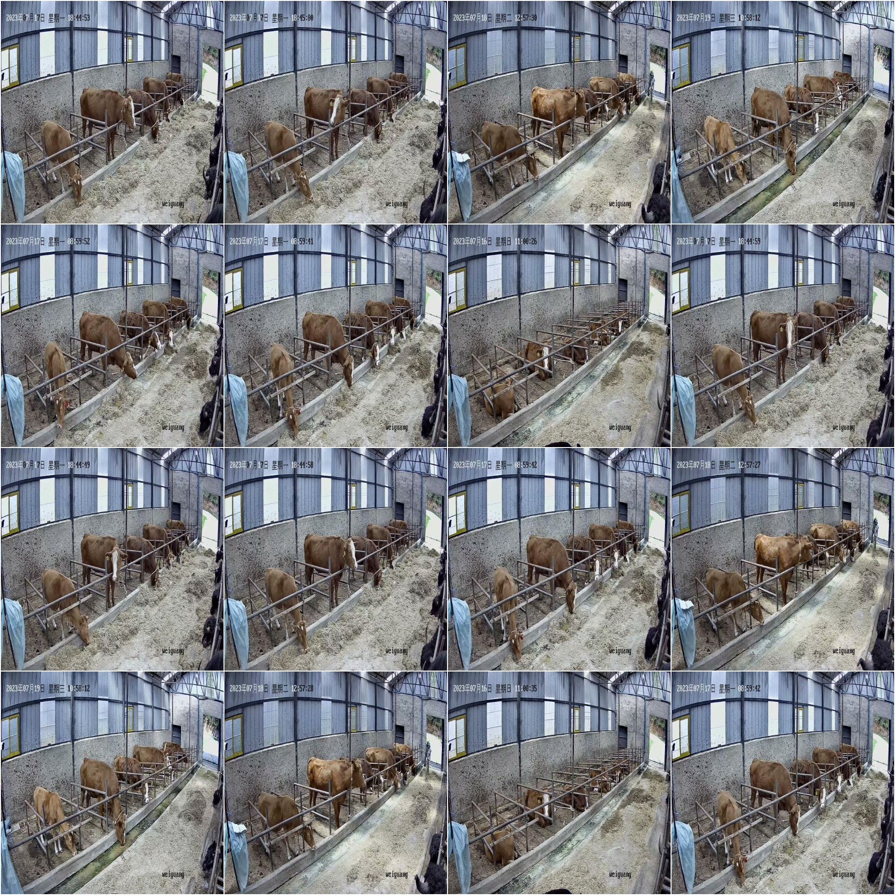
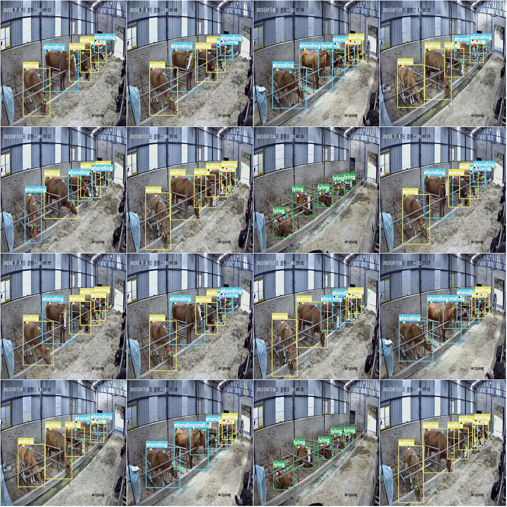

# Livestock Breeding Dataset: Key Points Posture Estimation and Detection Data COCO+YOLO Format, 497 Images in 3 Categories, 7 Key Points

Dataset Format: YOLO key point format (Note this is not the target detection or segmentation YOLO format, it only contains JPG images along with their corresponding YOLO format .txt files)
Number of Images (JPG file count): 497
Number of Annotations (.txt file count): 497
Training Set Count: 397
Validation Set Count: 50
Test Set Count: 50
Number of Classifications: 3
Classification Names: ['eating', 'lying', 'standing']
Key Point Categories: ["nose", "head_top", "neck", "shoulder", "back_mid", "hip", "tail_base"]
Number of Key Points in Each Category:
- eating: 1368
- lying: 496
- standing: 1028
Total Key Points: 2892
Image Resolution: 640x640
Important Notice: The dataset has been divided into training, validation, and test sets, which can be directly used for training Yolov5-pose, Yolov8-pose, Yolov11-pose, or Yolov26-pose models.
Special Reminder: This dataset does not guarantee the accuracy of the trained model or the weight files.
Sample Image Preview:
Annotation Example:
Original Image (randomly selected 16 images):
Annotation Drawing Results:

## Images

Here is a pay link on Stripe ( https://buy.stripe.com/3cs8yP7sY87d0vu9AB ). Please contact me lonlonago@foxmail.com after funding $89, and I will send you a complete data files , thank you!

